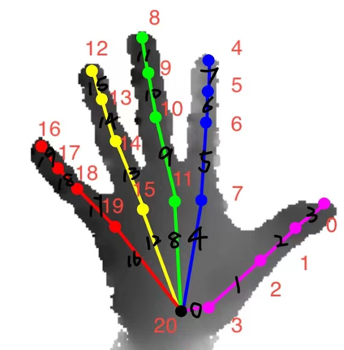

# Hand Anormaly Detection

手势异常数据分析/检测

## 支持：
- [x] 3D手势可视化demo
- [x] 基于pca异常数据检测
- [x] 基于ik(人体结构)异常数据检测

## 数据说明：
- 原数据集大小应为 $N \times 63$，63为21个点的3维坐标；
- PCA降维后数据大小应为 $N\times dim$，dim 为降到的维数，重构数据与原数据大小相同；
重构误差 **error.npy** 大小为 $N\times 1$；
- 计算的得到的向量数据 **vectors.npy** 为 $N\times 63$，63为20个向量加上一个手掌法向量的3维坐标；
向量长度 **lengths.npy** 大小为 $N\times 1$；
- 所有计算得到的骨骼特征数据均为 $N\times 5$。
- 原数据点坐标编号顺序与骨骼向量编号顺序如下图所示：

## 手势数据可视化demo(3D)
_用法_：

   - 下载数据集后，执行 `python vis_demo.py [-p path]`。运行后使用方法见 `help` 中内容。

## 进行基于pca的数据异常检测
_使用步骤_：
1. 下载数据集后，执行 `python pca.py [-p path]`。

   其中 `dim` 为降维维数，也可以更改数据和模型的保存路径。

2. 可通过执行 `python showimage.py [-p path]` ，查看重构误差最大的前250个数据重构前后3D可视化结果，
通过可视化评估PCA降维重构后的重构误差用于异常检测效果如何。

   以下为测试结果供参考：PCA 63 --> 10\
（原数据集使用 20220420_V02MANO_train.npy ，异常与否为本人手动判断与记录，
可能存在主观判断产生的误差）

   | 误差TOP排名区间 | 异常数据数量 | 累计异常数据频率 |
   |:---------:|:------:|:--------:|
   |   1-50    |   50   |   100%   |
   |  51-100   |   50   |   100%   |
   |  101-150  |   49   |  99.67%  |
   |  151-200  |   48   |  98.5%   |
   |  201-250  |   41   |  95.2%   |

3. 使用筛选器对目标数据进行异常检测

    执行 `python arbiter.py [-p path]`，其中 `model_path` 为1.中保存的PCA模型，`threshold` 的大小需要根据降维的维度以及可接受的准确率来修改。\
检测为异常的数据结果将保存在一个csv文件中，内容为其在原数据集中的索引与标签’abnormal’。

   以下为阈值选择参考：PCA 63 --> 10\
（使用数据集 20220420_V02MANO_train.npy 得到，异常与否为本人手动判断与记录，
频率一项可能存在主观判断产生的误差）

   | 误差TOP排名区间 | 累计异常数据频率 |   到此处阈值大小   |
   |:---------:|:-----------:|:------------:|
   |   1-50    |   100%   | 0.03259421  |
   |  51-100   |   100%   | 0.027810346 |
   |  101-150  |  99.67%  | 0.024816154 |
   |  151-200  |  98.5%   | 0.022588814 |
   |  201-250  |  95.2%   | 0.020813039 |

## 进行基于ik(人体结构)异常数据检测
_使用步骤_：
1. 执行 `python cal_vectors.py [-p path]`

    计算骨骼对应的向量及长度，数据将保存在新建文件夹 **intermediate** 中。

2. 执行 `python cal_features.py`

    计算手指骨骼的各种特征数据，数据保存在文件夹 **intermediate** 中。

    说明： \
**palm_finger_angles.npy** 为手指关键节点(见程序注释)角度；\
**surf_surf_angles.npy** 为手指1、2骨骼平面与3、4骨骼平面夹角；\
**fin_surf_angles.npy** 为手指第2骨骼与3、4骨骼平面夹角；\
**bias_angles.npy** 为第2骨骼左右偏移角度(与第1骨骼和手掌法向所形成平面的夹角)；\
**front_angles.npy** 为第2骨骼前后偏移角度(与手掌所在平面的夹角)；\
**tail_bias_angles.npy** 为第4骨骼左右偏移角度；\
**tail_front_angles.npy** 为第4骨骼前后偏移角度。

3. 执行 `python draw_scats.py` (可选)

   若执行此步将根据2.中计算得到的特征数据绘制反应骨骼特征关系的2维散点图，图片保存在新建文件夹 **figures** 中。
   
   说明：0/1/2/3/4 分别代表大拇指、食指、中指、无名指和小拇指\
**key_joint_ij.png** 为i/j两个手指关键关节角度关系的散点图(这里的关键关节指大拇指的第2骨骼和第3骨骼的夹角，其他手指的第1骨骼和第2骨骼夹角)。
根据 **palm_finger_angles.npy** 绘制；\
**bias_front_i.png** 为第i个手指第2骨骼左右角度与前后角度关系的散点图。
根据 **bias_angles.npy** 与 **front_angles.npy** 绘制；\
**tail_i.png** 为第i个手指第4骨骼左右角度与前后角度关系的散点图。
根据 **tail_bias_angles.npy** 与 **tail_front_angles.npy** 绘制；\
**fnt_bias_i.png** 为第i个手指的第2与第4骨骼左右角度关系的散点图。
根据 **bias_angles.npy** 与 **tail_bias_angles.npy** 绘制；\
**fnt_front_i.png** 为第i个手指的第2与第4骨骼前后角度关系的散点图。
根据 **front_angles.npy** 与 **tail_front_angles.npy** 绘制。

4. 执行 `python cleaning.py [-p path]`

    根据判断逻辑对原数据集进行异常检测，保存清理后的数据集与异常数据到新建文件夹 **output** 中。
文件名分别为 **after_cleaning.npy** 与 **anorm.npy**。
   
   异常检测由5个大逻辑构成，详情请见 `cleaning.py` 的函数的定义部分。每个大逻辑由若干小逻辑构成，来源为3.中绘制的30张图片。\
每张图片的聚集区域由若干条线段围成，使用其他数据集可能需要对方程超参数进行修改，修改依据为新数据集执行程序后绘制的图片，图片与逻辑的对应关系详见注释。

5. 正确或异常数据可视化；查看异常检测效果

   - 可视化操作方法见[手势数据可视化demo](#手势数据可视化demo3d)，注意 _path_ 修改为清洗后的数据或者异常数据的路径和文件名。
   - 检验效果可通过[PCA](#进行基于pca的数据异常检测)的1.和2.两步。将待PCA检测数据路径在 _path_ 修改为清理后的
   **after_cleaning.npy**。看看清理后的数据经过PCA后重构误差最大的250个数据里异常的占比，与检测前的进行对比。\
   以下结果供参考：(原数据集为 20220420_V02MANO_train.npy)
   
      | | TOP250中异常数据数量 | 异常数据占比 |
      |:-------------:|:-------------:|:------:|
      |    清理前   |      247      | 98.8%  |
      |    清理后   |      93       | 37.1%  |
